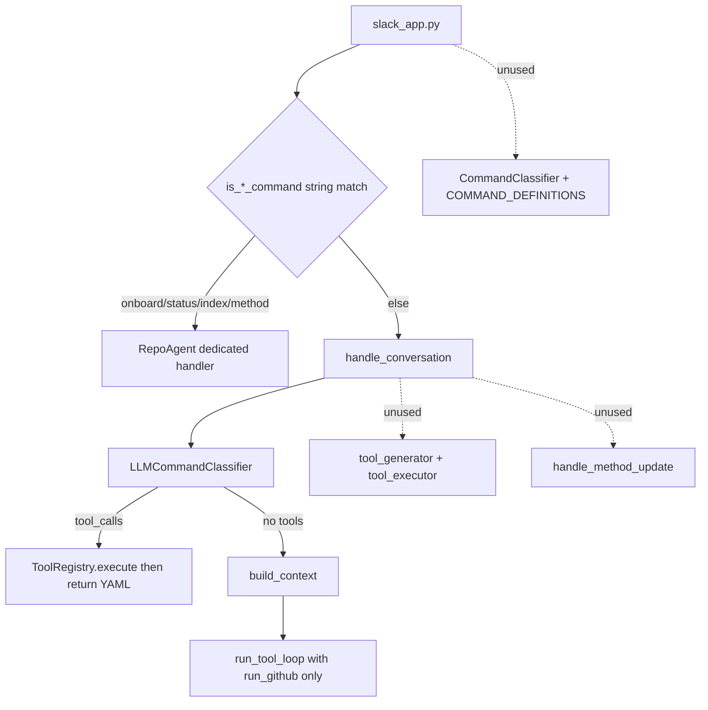

# Architecture Simplification Review

One-sentence summary:
A review of simplifications and data-layout changes that Benedict can make without losing user-visible behaviour.

## 1. Overview

**What:**
This document lists overlapping modules, mixed persistence, and composition leaks in the current tree. Each recommendation keeps Slack commands, repo Q&A, method/metadata tools, architect queries, indexing, and GitHub CLI working.

**Why:**
The product outgrew the original v0 bot. New layers were added beside old ones instead of replacing them. `RepoAgent` is about 1,900 lines. Several command and tool modules have no runtime callers. Channel config and conversation history share one JSON file. `.gitignore` excludes `src/benedict/lib/`, so clones can miss logging and date helpers that `main.py` imports.

**When to use:**
Use this when planning refactors. Do not treat it as a mandate to rewrite the Slack loop in one pass. The order in section 6 is the safe sequence.

## 2. Non-Goals

This review does not:

- Change behaviour in this pull request (documentation only)
- Add GitHub API as a `RepoReader`
- Restore the deleted git/file watcher Slack notifier
- Redesign the Slack UX or the method-file schema
- Choose prompt-first vs tools as a product decision (see `plans/PROMPT_FIRST_VS_TOOLS.md` if present)

Out of scope: performance work unless it falls out of deleting unused paths.

## 3. Key Concepts & Terminology

| Term | Meaning |
| --- | --- |
| **Composition root** | `main.py`, the only place that should construct concrete services |
| **Dead module** | Code that is imported or exported but never called on a Slack event path |
| **Classifier path** | First LLM call in `handle_conversation` with method/metadata tools; results go straight to Slack |
| **Query path** | Fallback that builds a context prompt and calls Claude, optionally with `run_github` |
| **Workspace** | Per-channel directory with a symlink or copy of the local repo |
| **state.json** | Single file holding `channels`, `conversations`, and `architect` |
| **Method file** | `.benedict.method.yaml` (phase, concerns, rules) |
| **Metadata file** | `.metadata.benedict` (directory summary) |

## 4. High-Level Design

Benedict is a protocol-based Slack agent. That shape is still right. The cost is duplication around it.

**Main components that still earn their keep**

- `main.py` — wiring
- `slack_app.py` — Slack events and formatting
- `RepoAgent` — too many responsibilities (see 6.4)
- Protocols + one implementation each for LLM, repo read, index, conversations, change detection
- Workspace, method, metadata, ChromaDB indexer
- `Tool` / `ToolRegistry` / `run_tool_loop` / `RunGithubTool`

**Data flow today**

A mention hits string matchers on `RepoAgent`. Commands never use `CommandClassifier`. Everything else enters `handle_conversation`, which may spend an LLM call on method tools, then a second call with a large system prompt. Channel maps and threads are read and written through two classes against the same `state.json`.

**Invariants to keep**

- Optional LLM, indexer, and history indexer still degrade
- Each channel still has an isolated workspace
- Concrete types still constructed at the root after the split
- Method writes still require an explicit user intent (tool or command)

## 5. API / Interface

No public API change is required for the simplifications below.

Internal contracts that should stay:

**Input (Slack):** channel id, user id, cleaned text, thread ts.

**Output (Slack):** success flag plus message text (later: structured payload, see 6.7).

**Persistence:** channel → repo map, architect channel, per-thread messages, ChromaDB collections, workspace files.

## 6. Happy Path: recommended order

Do these in order. Each step is independently shippable. None removes a Slack command or Q&A capability.

### Step 1 — Fix packaging of `src/benedict/lib`

**Problem:** `.gitignore` contains `lib/`, which matches `src/benedict/lib/`. `logging.py` and `dateutil.py` exist on disk and are imported from `main.py`, `git_change_detector.py`, the indexer, and Slack history code. They are not tracked. A fresh clone can fail at startup.

**Change:** Ignore only virtualenv `lib/` directories (for example `/lib/` at repo root, or `/.venv/lib/`). Track `src/benedict/lib/`. Align package `__version__` with `pyproject.toml` if that drift remains.

**Functionality:** Restores intended behaviour. Does not add features.

### Step 2 — Delete dead command/tool stacks

These have no caller on the Slack path:

| Module or symbol | Why it is unused |
| --- | --- |
| `commands/command_classifier.py` | `slack_app.py` uses `is_onboard_command` and similar |
| `commands/command_definitions.py` | Only consumed by the unused regex classifier |
| `commands/tool_generator.py` | Tool schemas live on `Tool.get_schema()` |
| `commands/tool_executor.py` | Execution goes through `ToolRegistry.execute` |
| `create_tool_registry()` | Runtime uses `create_tool_registry_from_method_data()` |
| `RepoAgent.handle_method_update` | Never called from `slack_app.py` |

**Change:** Remove the modules and the dead method. Keep `LLMCommandClassifier`, `Tool` classes, the registry factory that is actually used, and the dedicated Slack handlers.

**Functionality:** Identical. Those paths never ran.

### Step 3 — Split `state.json`

**Problem:** `RepoAgent.load_state` / `save_state` and `JsonConversationRepository` both read and write the same file. Saving conversations reloads the whole document; saving channels does the same. Concurrent writes can drop keys. The file mixes config and potentially large thread histories.

**Change:** Two files, same JSON shape per concern:

- `state.json` — `channels` and `architect` only
- `conversations.json` (or `{data_dir}/conversations.json`) — `conversations` only

Keep the `ConversationRepository` protocol. Point `RepoAgent` channel helpers at the channel store only.

**Functionality:** Same mappings and history. Safer writes.

### Step 4 — Split `RepoAgent` by handler

**Problem:** One class owns onboard path resolution, Slack command text, method CRUD, index updates, architect queries, and the conversation/tool loop.

**Change:** Keep `RepoAgent` as a thin facade or replace it with injected handlers:

- `ChannelOnboarding` — onboard, offboard, status, repo path resolution
- `ConversationService` — `handle_conversation` + tool loop
- `ArchitectService` — architect onboard and cross-repo queries
- `IndexService` — `handle_update_index`
- `MethodService` — create-method command only (tools already cover updates)

`slack_app.py` depends on a small protocol (`handle_app_mention` routing table) rather than 1,900 lines of mixed methods.

**Functionality:** Same commands and replies. Tests can target one handler.

### Step 5 — One tool loop, one registry

**Problem:** Conversation uses two LLM philosophies. The classifier executes method/metadata tools and returns formatted YAML with no second model pass. The query path injects the same facts into the prompt, then runs `run_tool_loop` with only `run_github`. The query prompt still tells the model to call `get_method_state`, which is not in that registry. Read tools duplicate `build_context`. Write tools exist both as classifier tools and as unused `handle_method_update`.

**Change:** After Slack command routing:

1. Build context once (prompt-first for reads).
2. Register write tools plus `run_github` (and create-method if the file is missing).
3. Call `run_tool_loop` once.
4. Drop `LLMCommandClassifier` as a separate first pass, or keep it only if you still want a cheap “this is an operational command” gate.

Detail and trade-offs: `plans/PROMPT_FIRST_VS_TOOLS.md` (if checked in). This review only requires collapsing two runtimes into one so the model cannot be told to call a tool it does not have.

**Functionality:** Users can still read method state (from context), update method files (write tools), and run `gh`.

### Step 6 — Bind `RepoReader` at the composition root

**Problem:** `main.py` constructs a local `RepoReader`. `handle_conversation` then builds `WorkspaceRepoReader` + `WorkspaceRepoReaderAdapter` per message. `RepoAgent` also constructs `MetadataGenerator`, `MethodReader`, `MethodWriter`, and sometimes a `ConversationRepository`.

**Change:** If a workspace manager exists, `main.py` should inject a workspace-bound reader factory (`channel_id → RepoReader`). Inject method and metadata services too. Stop constructing them inside the agent.

**Functionality:** Same files are read, from the workspace symlink as today.

### Step 7 — Structured Slack responses

**Problem:** Handlers return emoji-prefixed strings. `slack_app.py` parses those strings back into Block Kit fields. `utils/slack_formatter.py` is about 900 lines, partly to undo that round-trip.

**Change:** Return a small dataclass (`StatusPayload`, `ErrorPayload`, `MarkdownPayload`). Formatting stays in `slack_app.py`. Delete the string parser.

**Functionality:** Same Slack messages, fewer parse bugs.

## 7. Edge Cases & Failure Modes

**What can fail if refactors are sloppy**

- Deleting `CommandClassifier` while leaving `slack_app.py` string matchers in place is safe. Replacing matchers without tests can mis-route “what's the status of auth?” because `is_status_command` is currently `"status" in text.lower()`.
- Splitting `state.json` must migrate existing files that already contain `conversations`.
- Unifying the tool loop must keep mutating GitHub behind an ask-first prompt.
- Tracking `src/benedict/lib` after the gitignore fix will show as new files. That is expected.

**What the system still guarantees**

- Un-onboarded channels still get the onboard prompt
- Missing Anthropic key still yields stub replies
- Missing `gh` still allows Q&A; the tool error should stay local to GitHub asks

## 8. Constraints & Assumptions

- Python 3.10+, Socket Mode, local checkouts only
- One process; no multi-writer locking beyond “don’t share one JSON file for two concerns”
- Tests today cover GitHub CLI and the tool loop, not `RepoAgent` routing. Handler splits should add those tests as they move
- `.metadata.benedict` files generated inside this repo are workspace/index artifacts; they should not be committed (gitignore or generate only under `workspaces/`)

## 9. Alternatives Considered

**Rewrite `agent.py` in one PR** — rejected because it mixes deletion, persistence, and LLM-loop changes. Review cost is high and regressions are hard to attribute.

**Keep regex `CommandClassifier` and delete `is_*` methods** — rejected for now. Slack routing needs deterministic commands (onboard, offboard). The regex classifier was never wired. Wire it later only if string matchers become a maintenance problem, and tighten `status` matching first.

**SQLite instead of split JSON** — rejected for this pass. Two files remove the overwrite bug without a new dependency. SQLite is reasonable later if conversation volume grows.

**Prompt-only, no tools** — rejected as a default. Writes to method files and `gh` need a structured side effect. Reads can stay prompt-first.

## 10. Open Questions

**Q1:** Should `.metadata.benedict` generation write into the user’s repo (current) or only into the workspace copy? Writing into the repo produces untracked files in every onboarded project.

**Q2:** After step 5, do write tools still need enum-enhanced schemas from the method file, or is a generic `update_method` enough?

**Q3:** Merge `WorkspaceRepoReader` and the adapter into one `RepoReader` implementation that takes `channel_id` at construction time?

**Q4:** `plans/MILESTONE_STATUS.md` still lists M2 GitHub API as next and quotes version 0.2.6. Should that file be archived in favour of README + CHANGELOG?

## 11. Appendix

### Unused vs live (commands)

| Live | Unused |
| --- | --- |
| `slack_app.py` `is_*` routing | `CommandClassifier` |
| `LLMCommandClassifier` + method/metadata `Tool`s | `MethodMetadataToolGenerator` |
| `ToolRegistry.execute` | `MethodMetadataToolExecutor` |
| `handle_create_method` from Slack | `handle_method_update` |
| `run_tool_loop` + `RunGithubTool` | Second factory `create_tool_registry()` |

### Persistence map

| Data | Where it lives today | Better home |
| --- | --- | --- |
| Channel → repo | `state.json` `channels` | `state.json` only |
| Architect channel | `state.json` `architect` | `state.json` only |
| Thread messages | `state.json` `conversations` | `conversations.json` |
| Vector index | `.chroma_db/` | unchanged |
| Repo symlink | `workspaces/<channel>/` | unchanged |
| Action log | workspace `.benedictw` / action log | unchanged |
| Method / metadata | inside the onboarded repo | decide Q1 |

### Suggested first PR after this review

1. Fix `lib/` gitignore and add `src/benedict/lib` to version control
2. Delete the unused command/tool modules listed in step 2
3. Add a unit test that `slack_app` routing still hits onboard, offboard, status, update index, and create method

No user-visible change except that clones start reliably.
