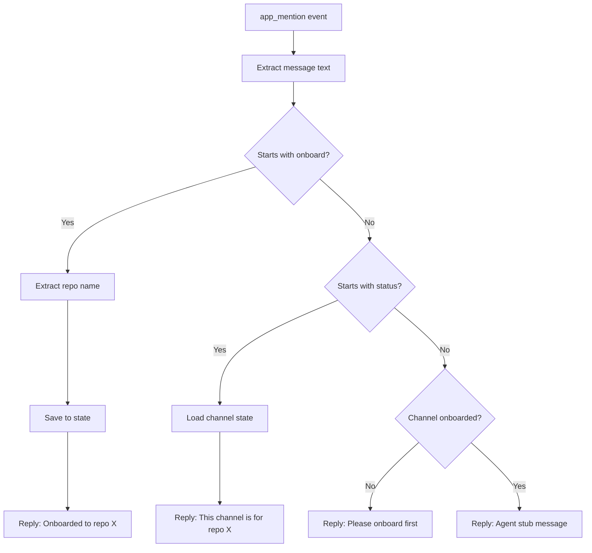

# Slack Repo Agent - Simplified Architecture

## Overview
Building a Slack bot that acts as a **repo-scoped AI agent** you can have conversations with. The bot has context about a specific repository and can discuss code, architecture, and project direction.

## Core Concept - Simplified

### Use Slack's Native Mechanics
- **Channel membership = Access**: Use Slack's built-in invite/remove for agent access control
- **Channel = Repo context**: Each channel is linked to one repository
- **Natural conversation**: Just @mention the bot and talk - no complex command syntax needed

### What We're Actually Building (v0)
1. A Slack bot that responds when @mentioned
2. Simple onboarding: tell it which repo the channel is about
3. The bot remembers the repo context per channel
4. Stub responses (no LLM yet) proving the infrastructure works

### Interaction Model
- **@mention to talk**: `@agent what's the architecture of the auth module?`
- **Minimal commands**: Just `onboard` and `status` - that's it
- **Thread replies**: Keeps conversations organized
- **Leverage Slack**: Use channels, threads, and native user management

## Simplified Architecture

### 1. State Management - Minimal

#### State Schema (Much Simpler)
```json
{
  "channels": {
    "C12345": {
      "repo": "foo/bar",
      "onboarded_at": "2026-02-01T20:30:00Z",
      "onboarded_by": "U123456"
    },
    "C67890": {
      "repo": "baz/qux",
      "onboarded_at": "2026-02-01T20:35:00Z",
      "onboarded_by": "U123456"
    }
  }
}
```

**That's it.** No agent lists, no escalation config, no modes. Just: which repo does this channel care about?

#### Persistence
- File: `state.json`
- Load on startup
- Save after onboard command

### 2. Commands - Minimal

Only **2 commands** needed:

1. **Onboard**
   ```
   @agent onboard repo foo/bar
   ```
   Or natural language:
   ```
   @agent this channel is for the foo/bar repository
   ```
   Effect: Store repo mapping for this channel

2. **Status**
   ```
   @agent status
   ```
   Effect: Show which repo this channel is linked to

**That's it.** No invite, no remove, no council, no help command needed.

### 3. Natural Conversation (v0 = stub)

Any other @mention is treated as a conversation:
```
@agent what files handle authentication?
@agent explain the database schema
@agent should we refactor the API layer?
```

**v0 Response (stub):**
```
I'm the agent for `foo/bar`. 
(LLM integration not wired yet - but I know we're talking about foo/bar!)
```

**Future (v1+):** Actually read repo, use LLM, provide intelligent responses

### 4. Event Handler Flow - Simplified



### 5. Slack Integration

#### Technology Stack
- **Framework**: Slack Bolt for Python
- **Connection**: Socket Mode (no public webhook needed)
- **Event**: `app_mention` only

#### Required Tokens
1. **Bot Token** (`SLACK_BOT_TOKEN`)
   - Scopes: `chat:write`, `channels:history`, `channels:read`
   
2. **App-Level Token** (`SLACK_APP_TOKEN`)
   - Scope: `connections:write`

#### App Configuration Steps
1. Create Slack app at api.slack.com/apps
2. Enable Socket Mode
3. Create App-Level Token
4. Add Bot Token Scopes
5. Subscribe to `app_mention` event
6. Install app to workspace
7. Invite bot to channels

### 6. Response Formatting

#### Onboard Success
```
✅ Onboarded! This channel is now linked to `foo/bar`.
I'll remember this repo for all our conversations here.
```

#### Status Display
```
📊 Channel: #proj-foo
🔗 Repository: foo/bar
⏰ Onboarded: 2026-02-01 by @alice
```

#### Conversation Stub (v0)
```
I'm your agent for `foo/bar`. 
(LLM not connected yet, but I'm ready to learn about this repo!)
```

#### Error Messages
- ⚠️ emoji prefix
- Clear explanation
- Guidance for resolution

### 7. File Structure

```
/
├── app.py              # Main application (single file, ~150 lines)
├── requirements.txt    # Python dependencies
├── README.md          # Setup & testing guide
├── state.json         # Runtime state (created on first run)
└── .env.example       # Environment variable template
```

## Implementation Details

### app.py Structure

```python
# 1. Imports (slack_bolt, json, os, re)
# 2. State management
#    - load_state() -> dict
#    - save_state(state: dict)
#    - get_channel_repo(channel_id: str) -> str | None
#    - set_channel_repo(channel_id: str, repo: str, user_id: str)
# 3. Simple command detection
#    - is_onboard_command(text: str) -> bool
#    - is_status_command(text: str) -> bool
#    - extract_repo_name(text: str) -> str | None
# 4. Event handler
#    - handle_app_mention(event, say)
# 5. Slack app initialization
# 6. Main entry point
```

**Simplified from ~300 lines to ~150 lines**

### Key Design Decisions

1. **Single File**: All code in `app.py` (~150 lines)
2. **Minimal State**: Just channel → repo mapping
3. **Thread Replies**: Keep conversations organized
4. **Natural Language**: Accept flexible onboard syntax
5. **No LLM Yet**: Stub responses proving infrastructure works
6. **Leverage Slack**: Use native invite/remove for access control

### Error Handling Strategy

1. **Missing Environment Variables**: Fail fast on startup
2. **State File Corruption**: Create new empty state
3. **Slack API Errors**: Log and reply with error message
4. **Duplicate Onboard**: Just update the repo (idempotent)
5. **Status on Non-Onboarded Channel**: Friendly prompt to onboard

## Testing Strategy

### Test Scenarios

1. **Basic Onboarding**
   - Create `#proj-foo`
   - `@agent onboard repo foo/bar`
   - `@agent status` → confirms `foo/bar`

2. **Multiple Channels**
   - Create `#proj-bar`
   - `@agent onboard repo baz/qux`
   - Verify each channel has different repo

3. **Conversation Stub**
   - `@agent what's the architecture?`
   - Should get stub response mentioning the repo

4. **Natural Language Onboard**
   - `@agent this is for the acme/widget repo`
   - Should extract and onboard `acme/widget`

5. **Error Cases**
   - Talk to agent in non-onboarded channel
   - Onboard with invalid repo format

### Validation Checklist

- [ ] Bot responds only to @mentions
- [ ] All replies are in-thread
- [ ] State persists across restarts
- [ ] Each channel stores its repo independently
- [ ] Onboard command works with flexible syntax
- [ ] Status shows repo and onboard info
- [ ] Conversation attempts give helpful stub response
- [ ] Non-onboarded channels get friendly prompt

## Future Extensions (Not in v0)

### Phase 1 (v0 - This PR)
- ✅ Slack connection via Socket Mode
- ✅ Channel → Repo mapping
- ✅ Onboard & status commands
- ✅ Stub conversation responses

### Phase 2 (v1 - Next)
- 🔄 LLM integration (Claude/GPT-4)
- 🔄 GitHub API: read repo files
- 🔄 Basic code Q&A

### Phase 3 (v2 - Future)
- 🔄 Notion integration
- 🔄 Google Docs access
- 🔄 Cursor session logs
- 🔄 Multi-repo context
- 🔄 Agent-to-agent communication

### Phase 4 (v3 - Advanced)
- 🔄 RAG/vector search over codebase
- 🔄 Proactive suggestions
- 🔄 Code review automation
- 🔄 Architecture analysis

## Dependencies

### Core
- `slack-bolt` - Slack app framework
- `python-dotenv` - Environment variable management

### Standard Library
- `json` - State persistence
- `os` - Environment variables
- `re` - Command parsing
- `logging` - Debug output

## Environment Variables

```bash
SLACK_BOT_TOKEN=xoxb-...
SLACK_APP_TOKEN=xapp-...
```

## Success Criteria

✅ Bot connects to Slack via Socket Mode
✅ Responds only to @mentions in threads
✅ Onboard command links channel to repo
✅ Status command shows repo info
✅ Maintains separate repo per channel
✅ Persists state to JSON file
✅ Handles conversations with stub response
✅ Includes comprehensive README
✅ Simple, focused, extensible

## Why This Approach?

### Leverage Slack's Strengths
- **Channel membership**: Use Slack's native invite/kick instead of custom agent lists
- **Threads**: Built-in conversation context
- **@mentions**: Natural interaction model
- **Channels**: Natural project boundaries

### Focus on Core Value
The real value is: **"An AI agent that knows my repo and can discuss it intelligently"**

Everything else (agent lists, escalation, council channels) can be added later if needed, but they're not essential to prove the concept.

### Simplicity = Speed
- Fewer commands = less to test
- Less state = fewer bugs
- Natural language = better UX
- ~150 lines vs ~300 lines

### Easy to Extend
Once v0 works, adding LLM + GitHub is straightforward:
1. Add OpenAI/Anthropic client
2. Add GitHub API client
3. Fetch repo files when mentioned
4. Pass to LLM with context
5. Return intelligent response

The infrastructure (Slack, state, routing) is proven and stable.
